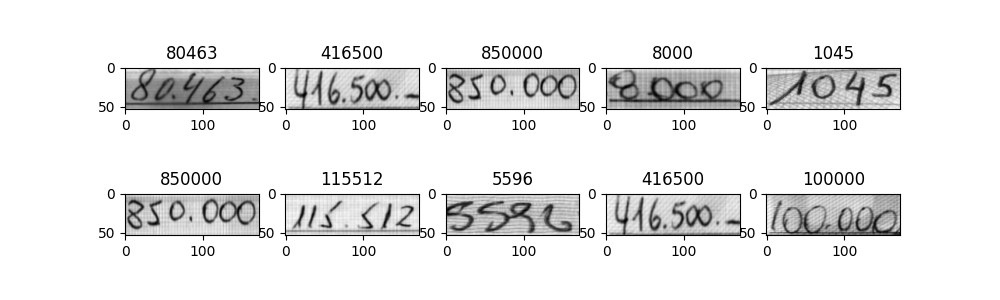

# Handwritten Text to Number Converter Model

The Handwritten Text to Number Converter is a project designed to convert handwritten text from images into corresponding numeric characters. In this task, you are provided with an image containing a series of characters (specifically, all numeric digits), and your goal is to extract and output the characters based on the image.

## Model Overview

This project involves training a model using the Connectionist Temporal Classification (CTC) loss function. The model takes the entire image into account and employs an RNN (Recurrent Neural Network) layer to predict a character for each pixel column. Two decoding methods have been explored for generating the output:

- **Beam Search Decoder**: This decoder considers multiple possible character sequences and selects the most likely one based on a beam width parameter. It helps improve the accuracy of the extracted text.

- **Best Path (Greedy) Decoder**: This decoder selects the most likely character at each step, making the most immediate decision without considering future steps. While computationally efficient, it may not always produce the most accurate results compared to the beam search.

## Dataset

To accomplish this task, you can obtain the dataset from the following link: [Handwritten Text to Number Converter Dataset](https://www.orand.cl/orand_car/ORAND-CAR-2014.tar.gz). This dataset includes two directories that, when combined, form the training data. The character error rate is utilized as the evaluation metric to gauge the model's performance.

## Download Model Results
The image below demonstrates the model's predictions on handwritten text images. 

Download the model results from this URL: [Model Results](https://drive.google.com/file/d/1zw_BK6HkCtJex0xJh3cI34iTnZhpBWy7/view?usp=sharing) and utilize TensorBoard for viewing and analyzing them.

